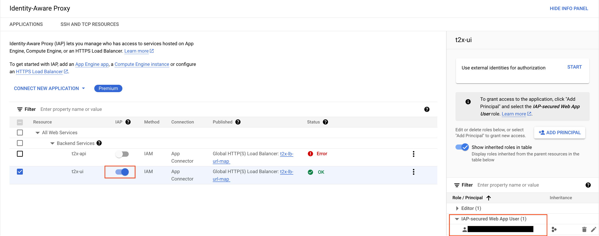

# TALK TO DOCS APPLICATION DEPLOYMENT WITH TERRAFORM
([back to Terraform overview](terraform_overview.md))

## Overview
Terraform modules to stage and deploy the application components. The `bootstrap` module provisions the Cloud Build service account, IAM roles, and staging bucket for the main modules. The `main` module provisions all other components. 

- [Architecture](#architecture)
- [Directory Structure](#directory-structure)
- [Deployment steps](#deployment-steps)
- [Prerequisites](#prerequisites)
    - [Initialize](#1-initialize)
    - [Create a service account for Terraform provisioning](#2-create-a-service-account-for-terraform-provisioning)
    - [Grant the required IAM roles to the service account](#3-grant-the-required-iam-roles-to-the-service-account)
    - [Use Service Account Impersonation](#4-use-service-account-impersonation)
    - [Terraform remote state](#5-terraform-remote-state)
- [Bootstrap](#bootstrap)
- [Automate Deployments with Cloud Build](#automate-deployments-with-cloud-build)
    - [Configure `gen_ai/llm.yaml`](#1-configure-gen_aillmyaml)
    - [Configure optional input variable values in `terraform/main/vars.auto.tfvars`](#2-configure-optional-input-variable-values-in-terraformmainvarsautotfvars)
    - [Set environment variables](#3-set-environment-variables)
    - [Build & push the docker images and apply the Terraform configuration](#4-build--push-the-docker-images-and-apply-the-terraform-configuration)
- [Add an A record to the DNS Managed Zone](#add-an-a-record-to-the-dns-managed-zone)
- [Test the endpoint](#test-the-endpoint)
- [Stage document extractions](#stage-document-extractions)
    - [Migrate document extractions to the staging bucket with user credentials](#migrate-document-extractions-to-the-staging-bucket-with-user-credentials)
    - [Migrate document extractions to the staging bucket using impersonated service account credentials](#migrate-document-extractions-to-the-staging-bucket-using-impersonated-service-account-credentials)
- [Prepare the Discovery Engine Data Store using Cloud Workflows](#prepare-the-discovery-engine-data-store-using-cloud-workflows)
- [Configure Identity-Aware Proxy](#configure-identity-aware-proxy)

### REFERENCE INFO
- [Rollbacks](#rollbacks)
    - [Option 1: Use the Cloud Console to switch Cloud Run service traffic to a different revision](#option-1-use-the-cloud-console-to-switch-cloud-run-service-traffic-to-a-different-revision)
    - [Option 2: Rollback to a different Docker image using Terraform](#option-2-rollback-to-a-different-docker-image-using-terraform)
- [[OPTIONAL] Prepare the Discovery Engine Data Store 'manually' using HTTP](#optional-prepare-the-discovery-engine-data-store-manually-using-http)
    - [Create metadata](#1-create-metadata)
    - [Purge documents](#2a-optional-purge-documents)
    - [Import documents](#2b-import-documents)
    - [Verify the operation](#3-verify-the-operation)
- [Security](#security)
- [Observability](#observability)
- [Terraform Overview](#terraform-overview)
    - [Terraform command alias](#terraform-command-alias)
    - [Initialize](#initialize)
    - [Workspaces](#workspaces)
    - [Terraform Backends](#terraform-backends)
    - [Flexible Backends - Partial Configuration](#flexible-backends---partial-configuration)
    - [Reconfiguring a Backend](#reconfiguring-a-backend)
    - [Plan and Apply](#plan-and-apply)
- [Known issues](#known-issues)

&nbsp;
# Architecture
([return to top](#talk-to-docs-application-deployment-with-terraform))\


- Queries reach the T2X application through the [Cloud Load Balancer](https://cloud.google.com/load-balancing/docs/https).
- The T2X [backend service](https://cloud.google.com/load-balancing/docs/backend-service) is the interface for regional Cloud Run backends.
    - Regional failover: Cloud Run services [replicate](https://cloud.google.com/run/docs/resource-model#services) across more than one Compute zone to prevent outages for a single zonal failure.
    - Autoscaling: add/remove group instances to match demand and maintain a minimum number of instances for high availability.
- [Vertex AI Agent Builder](https://cloud.google.com/generative-ai-app-builder/docs/introduction) provides the [Search App and Data Store](https://cloud.google.com/generative-ai-app-builder/docs/create-datastore-ingest) for document search and retrieval.
- The application asynchronously writes log data to [BigQuery](https://cloud.google.com/bigquery/docs/introduction) for offline analysis.
- A [private DNS](https://cloud.google.com/dns/docs/zones#create-private-zone) hostname facilitates internal VPC communication with [Memorystore Redis](https://cloud.google.com/memorystore/docs/redis/memorystore-for-redis-overview) to support multi-turn conversations.
- [Gemini](https://cloud.google.com/vertex-ai/generative-ai/docs/learn/models) powers [generative answers](https://cloud.google.com/vertex-ai/generative-ai/docs/learn/overview).


&nbsp;
# Directory Structure
([return to top](#talk-to-docs-application-deployment-with-terraform))
```sh
terraform/ # this directory
├── README.md # this file
├── assets/ # architecture diagrams
├── bootstrap/ # provision project APIs, Cloud Build service account, IAM roles, and staging bucket
├── main/ # provision the talk-to-docs service components
└── modules/ # reusable Terraform modules called from the `main` module
```

&nbsp;
# Deployment steps
([return to top](#talk-to-docs-application-deployment-with-terraform))

1. Complete the prerequisites to prepare the Google Cloud project for Terraform.
2. Bootstrap the project with Terraform.
    - Enable APIs.
    - Create a Cloud Build service account with required IAM roles.
    - Create a document staging bucket.
    - Create an Artifact Registry repository.
3. Automate the deployment with Cloud Build.
    - Build a Docker image.
    - Push the Docker image to Artifact Registry.
    - Apply the Terraform configuration to deploy the T2X application components.
        - Cloud Run hosts the application using the Docker image from Artifact Registry.
        - Agent Builder Data Store and Search engine for [RAG](https://cloud.google.com/use-cases/retrieval-augmented-generation?hl=en).
        - Memorystore Redis for session management.
        - BigQuery for log data storage.
        - Cloud Load Balancer for HTTPS traffic routing and TLS encryption.
        - DNS Managed Zone for private DNS resolution.
        - VPC network and subnet for private communication between Cloud Run and Memorystore Redis.
4. Configure DNS and test the talk-to-docs endpoint.
5. Stage document extractions.
6. Import document extractions to the Discovery Engine Data Store using Cloud Workflows.
7. Configure Identity-Aware Proxy for talk-to-docs UI (gradio) Cloud Run services.


&nbsp;
# Prerequisites
([return to top](#talk-to-docs-application-deployment-with-terraform))

### **A [Project Owner](https://cloud.google.com/iam/docs/understanding-roles#owner) completes these steps to prepare the environment for Terraform provisioning.**
### **Commands in this repository assume `tf` is an [alias](https://www.man7.org/linux/man-pages/man1/alias.1p.html) for `terraform` in your shell.**
```sh
alias tf='terraform'
```


## 1. Initialize
- Install the [Google Cloud SDK](https://cloud.google.com/sdk/docs/install).
- Authenticate.
```sh
gcloud auth login
```

- Enable the Service Usage, IAM, and Service Account Credentials APIs.
```sh
gcloud services enable serviceusage.googleapis.com iam.googleapis.com iamcredentials.googleapis.com
```

- Set the default project. Wait up to a few minutes and try again if you encounter an error shortly after enabling the Service Usage API.
```sh
export PROJECT='my-project-id' # replace with your project ID
gcloud config set project $PROJECT
```

- Create [Application Default Credentials](https://cloud.google.com/docs/authentication/provide-credentials-adc)
```sh
gcloud auth application-default login
```

- Export the project ID as [Terraform environment variable](https://developer.hashicorp.com/terraform/language/values/variables#environment-variables). (Used automatically by later Terraform commands.)
```sh
export TF_VAR_project_id=$PROJECT
```


## 2. Create a service account for Terraform provisioning.
- **The examples in this document use the service account name `terraform-service-account` (with the example email address `terraform-service-account@my-project-id.iam.gserviceaccount.com`) but you can choose any name not already used in the project.**
- Change any subsequent commands in this document that use the service account name to match the name you choose.
```sh
gcloud iam service-accounts create terraform-service-account --display-name="Terraform Provisioning Service Account" --project=$PROJECT
```

- Export the service account email address as a [Terraform environment variable](https://developer.hashicorp.com/terraform/language/values/variables#environment-variables). (Used automatically by later Terraform commands.)
```sh
export TF_VAR_terraform_service_account="terraform-service-account@${PROJECT}.iam.gserviceaccount.com"
```


## 3. Grant the required [IAM roles](https://cloud.google.com/iam/docs/understanding-roles) to the service account.
```sh
roles=(
  "roles/ml.admin"
  "roles/artifactregistry.admin"
  "roles/bigquery.admin"
  "roles/cloudbuild.builds.editor"
  "roles/redis.admin"
  "roles/compute.admin"
  "roles/discoveryengine.admin"
  "roles/dns.admin"
  "roles/resourcemanager.projectIamAdmin"
  "roles/run.admin"
  "roles/iam.securityAdmin"
  "roles/iam.serviceAccountAdmin"
  "roles/iam.serviceAccountUser"
  "roles/serviceusage.serviceUsageAdmin"
  "roles/storage.admin"
  "roles/workflows.admin"
)

for role in "${roles[@]}"; do
  gcloud projects add-iam-policy-binding $PROJECT --member="serviceAccount:terraform-service-account@${PROJECT}.iam.gserviceaccount.com" --role=$role --condition=None
done

```

- AI Platform Admin (`roles/ml.admin`)
- Artifact Registry Administrator (`roles/artifactregistry.admin`)
- BigQuery Admin (`roles/bigquery.admin`)
- Cloud Build Editor (`roles/cloudbuild.builds.editor`)
- Cloud Memorystore Redis Admin (`roles/redis.admin`)
- Cloud Run Admin (`roles/run.admin`)
- Compute Admin (`roles/compute.admin`)
- Discovery Engine Admin (`roles/discoveryengine.admin`)
- DNS Admin (`roles/dns.admin`)
- Project IAM Admin (`roles/resourcemanager.projectIamAdmin`)
- Security Admin (`roles/iam.securityAdmin`) - required to [set IAM policies on DNS Managed Zones](https://cloud.google.com/dns/docs/zones/iam-per-resource-zones#expandable-1)
- Service Account Admin (`roles/iam.serviceAccountAdmin`)
- Service Account User (`roles/iam.serviceAccountUser`) - required to [attach service accounts to resources](https://cloud.google.com/iam/docs/attach-service-accounts)
- Service Usage Admin (`roles/serviceusage.serviceUsageAdmin`)
- Storage Admin (`roles/storage.admin`)
- Workflows Admin (`roles/workflows.admin`)


## 4. Use [Service Account Impersonation](https://cloud.google.com/iam/docs/service-account-impersonation).
Instead of creating and managing Service Account keys for authentication, this code uses an [impersonation pattern for Terraform](https://cloud.google.com/blog/topics/developers-practitioners/using-google-cloud-service-account-impersonation-your-terraform-code) to fetch access tokens on behalf of a Google Cloud IAM Service Account.

- Grant the caller (a Google user account or group address) permission to generate [short-lived access tokens](https://cloud.google.com/iam/docs/create-short-lived-credentials-direct) on behalf of the targeted service account.
    - The caller needs the Account Token Creator role (`roles/iam.serviceAccountTokenCreator`) or a custom role with the `iam.serviceAccounts.getAccessToken` permission that applies to the Terraform provisioning service account.
    - Create a [role binding on the Service Account resource](https://cloud.google.com/iam/docs/manage-access-service-accounts#single-role) instead of the project IAM policy to [minimize the scope of the permission](https://cloud.google.com/iam/docs/best-practices-service-accounts#project-folder-grants).
    - Perhaps counterintuitively, the primitive Owner role (`roles/owner`) does NOT include this permission.
```sh
export MEMBER='user:{your-username@example.com}' # replace '{your-username@example.com}' from 'user:{your-username@example.com}' with your Google user account email address
# Example to add a group -> export MEMBER='group:devops-group@example.com'

gcloud iam service-accounts add-iam-policy-binding "terraform-service-account@${PROJECT}.iam.gserviceaccount.com" --member=$MEMBER --role="roles/iam.serviceAccountTokenCreator"
```


## 5. Terraform [remote state](https://developer.hashicorp.com/terraform/language/state/remote)
- Create a GCS bucket for the remote Terraform state.
- **The examples in this document use the bucket name `terraform-state-my-project-id` but you can choose any name not already in use in the project.**
```sh
gcloud storage buckets create "gs://terraform-state-${PROJECT}" --project=$PROJECT
```


&nbsp;
# Bootstrap
([return to top](#talk-to-docs-application-deployment-with-terraform))

The `bootstrap` module provisions resources required for the main module. It should be a one-time setup for a new project, but you can re-run it to add or enable additional APIs to support future development.
- Project APIs.
- Cloud Build service account.
- Artifact Registry repository.
- Staging bucket for document extractions.
- IAM roles for the Cloud Build service account.
    - Project IAM policy: Cloud Build Service Account (`roles/cloudbuild.builds.builder`) role.
    - Terraform service account IAM policy: Service Account Token Creator (`roles/iam.serviceAccountTokenCreator`) role.
- [OPTIONAL] Data Mover service account IAM role.
    - **See [Stage document extractions](#stage-document-extractions) for information about migrating data with service account impersonation.**
    - The service account must already exist and have permission to read the document objects in the source Cloud Storage bucket.
    - This optional step updates the document extraction staging bucket IAM policy: add the Storage Object User (`roles/storage.objectUser`) role to the Data Mover service account you specify.
    - To configure an IAM policy for a Data Mover service account, set the `data_mover_service_account` [input variable](https://developer.hashicorp.com/terraform/language/values/variables#assigning-values-to-root-module-variablesvalues) value to the service account email address in `terraform/bootstrap/vars.auto.tfvars`.

Initialize the Terraform `bootstrap` module using a [partial backend configuration](https://developer.hashicorp.com/terraform/language/settings/backends/configuration#partial-configuration) and apply to provision resources.
```sh
export REPO_ROOT=$(git rev-parse --show-toplevel)
cd $REPO_ROOT/terraform/bootstrap

tf init -backend-config="bucket=terraform-state-${PROJECT}" -backend-config="impersonate_service_account=terraform-service-account@${PROJECT}.iam.gserviceaccount.com"

tf apply
```


&nbsp;
# Automate Deployments with Cloud Build
([return to top](#talk-to-docs-application-deployment-with-terraform))

- Use the [`gcloud CLI`](https://cloud.google.com/build/docs/running-builds/submit-build-via-cli-api) with [build config files](https://cloud.google.com/build/docs/configuring-builds/create-basic-configuration) to plan and deploy project resources.
Execute commands in each module.

## 1. Configure `gen_ai/llm.yaml`.
- `bq_project_id` - leave as `null`: ensures all API clients use Application Default Credentials with resources in the same project.
- `dataset_name` - the BigQuery dataset that will store T2X logs.
- `memory_store_ip` - the Memorystore Redis host - should always be `redis.t2xservice.internal`.
- `customer_name` - the company name used in the Agent Builder Search Engine.
- `vais_data_store` - the Agent Builder Data Store ID.
- `vais_engine_id` - the Agent Builder Search Engine ID.
- `vais_location` - the location for discoveryengine API (Agent Builder) resources, one of us, eu, or global

## 2. Configure optional [input variable](https://developer.hashicorp.com/terraform/language/values/variables#assigning-values-to-root-module-variablesvalues) values in `terraform/main/vars.auto.tfvars`.
- `global_lb_domain` - the domain name you want to use for the Cloud Load Balancer front end. You need control of the DNS zone to [edit the A record](#add-an-a-record-to-the-dns-managed-zone). If left unset, Terraform will default to using [nip.io](https://nip.io) with the load balancer IP address.
- `cloud_run_invoker_service_account` - the email address of a service account to grant the `roles/run.invoker` role on the Cloud Run services. It can be any service account you can use to generate ID tokens. If left unset, Terraform won't add any additional principal to the Cloud Run services.

## 3. Set environment variables
```sh
export REPO_ROOT=$(git rev-parse --show-toplevel)
export PROJECT='my-project-id' # replace with your project ID
export REGION='us-central1'
```

## 4. Build & push the docker images and apply the Terraform configuration

- Submit the build from the root directory as the build context.
- [OPTIONAL] Omit the `_RUN_TYPE=apply` substitution to run a plan-only build and review the Terraform changes before applying.
```sh
cd $REPO_ROOT
gcloud builds submit . --config=cloudbuild.yaml --project=$PROJECT --region=$REGION --substitutions="_RUN_TYPE=apply" --impersonate-service-account=terraform-service-account@${PROJECT}.iam.gserviceaccount.com
```


&nbsp;
# Add an A record to the DNS Managed Zone
([return to top](#talk-to-docs-application-deployment-with-terraform))

- **You do not need to configure DNS if you did not set a `global_lb_domain` value in `terraform/main/vars.auto.tfvars` and instead used the default `nip.io` domain.**
- Use the public IP address created by Terraform as the A record in your DNS host.
- **NOTE** A newly-created managed TLS certificate may take anywhere from 10-15 minutes up to 24 hours for the CA to sign after DNS propagates.
- The Certificate [Managed status](https://cloud.google.com/load-balancing/docs/ssl-certificates/troubleshooting#certificate-managed-status) will change from PROVISIONING to ACTIVE when it's ready to use.
- Navigate to Network Services > Load balancing > select the load balancer > Frontend: Certificate > Select the certificate and wait for the status to change to ACTIVE.


&nbsp;
# Test the endpoint
([return to top](#talk-to-docs-application-deployment-with-terraform))

- Verify the TLS certificate is active and the endpoint is reachable using `curl`.
- *It may take some more time after the certificate reaches ACTIVE Managed status before the endpoint responds with success. It may throw an SSLError due to mismatched client and server protocols until changes propagate.*
- [Authenticate](https://cloud.google.com/run/docs/authenticating/service-to-service) using a service account and the [Cloud Run custom audience](https://cloud.google.com/run/docs/configuring/custom-audiences) to generate an ID token.
- The service account must have the `roles/run.invoker` role on the Cloud Run service.
- The server responds with a 200 status code and `{"status":"ok"}` if the endpoint is reachable and the TLS certificate is active.
- [OPTIONAL] Consider skipping to the [Stage document extractions](#stage-document-extractions) step first then return here to test the endpoint while waiting for DNS propagation.
```sh
export AUDIENCE='https://34.54.24.62.nip.io/t2x-api' # replace with the Cloud Run Custom Audience (uses load balancer domain or nip.io domain plus the Cloud Run service name as the '/path') - will be displayed in Terraform main module outputs as 'custom_audience'.
export RUN_INVOKER_SERVICE_ACCOUNT='run-invoker-service-account@my-project-id.iam.gserviceaccount.com' # replace with the run invoker service account email address
export TOKEN=$(gcloud auth print-identity-token --impersonate-service-account=$RUN_INVOKER_SERVICE_ACCOUNT --audiences=$AUDIENCE)
curl -X GET -H "Authorization: Bearer ${TOKEN}" "${AUDIENCE}/health"
```


&nbsp;
# Stage document extractions
([return to top](#talk-to-docs-application-deployment-with-terraform))

Talk-to-docs uses pre-processed documents instead of directly importing raw PDFs or other formats into the Agent Builder Data Store. The pre-processed document extractions are text files and corresponding JSON metadata files with a prescribed schema used to sort and filter the documents in the Agent Builder Search Engine. Pre-processing currently occurs in an offline process that generates the document extractions in a 'source' Cloud Storage bucket.

- Copying document extractions from the source bucket to the staging bucket is currently a manual process not included in the Terraform configuration.
- The `t2x-api` service imports document extractions as [unstructured text plus metadata](https://cloud.google.com/generative-ai-app-builder/docs/prepare-data#storage-unstructured) from the **staging** bucket to the Agent Builder (Discovery Engine) data store.
- The authenticated principal migrating data to the staging bucket must have permission to read from the source bucket and write to the staging bucket.
- The Storage Object User role (`roles/storage.objectUser`) provides sufficient permission read from and write to both buckets.
- You can use the `gcloud` CLI with [user credentials](#migrate-document-extractions-to-the-staging-bucket-with-user-credentials) or [service account impersonation](#migrate-document-extractions-to-the-staging-bucket-using-impersonated-service-account-credentials) to copy the extractions.

## Source bucket structure
- The source bucket contains document extractions in a folder structure with a unique name for each dataset.
- In this example, the source bucket name (`$SOURCE_BUCKET`) is `uhg_data` and the dataset name is `extractions20240715`.


## Staging bucket structure
- Data migrated to the staging bucket is organized into datasets using folders named the same as the source bucket under a top-level `source-data` folder.
- This example shows the `extractions20240715` dataset already migrated to the staging bucket.


## Migrate document extractions to the staging bucket with user credentials
```sh
export SOURCE_BUCKET='{source_extractions_bucket_name}' # replace with the source extractions bucket name
# i.e. with the source bucket URI as 'gs://source-extractions-bucket' -> 'source-extractions-bucket'
export DATASET_NAME='{source_extractions_folder_path}' # replace with the source extractions folder path
# i.e. with the full source path URI as 'gs://source-extractions-bucket/extractions20240715' -> 'extractions20240715'
export STAGING_BUCKET='{staging_bucket_name}'  # replace with the staging bucket name
# i.e. with the staging bucket URI as 'gs://t2x-staging-my-project-id' -> 't2x-staging-my-project-id'

gcloud storage cp -r "gs://$SOURCE_BUCKET/$DATASET_NAME/*" "gs://$STAGING_BUCKET/source-data/$DATASET_NAME"
```

## Migrate document extractions to the staging bucket using impersonated service account credentials
1. Create a Data Mover service account with permission to read from the **source extractions** bucket.
2. Grant the Data Mover service account the Storage Object User role on the **staging bucket** in the deployment project.
    - Add the Data Mover service account email address as the value of the `data_mover_service_account` input variable to the `bootstrap` Terraform module when [applying the configuration](#bootstrap).
    - The `bootstrap` module grants the Data Mover service account the Storage Object User role on the staging bucket IAM policy.
    - [OPTIONAL] You could instead manually (with `gcloud` or the cloud console) grant the Data Mover service account the Storage Object User (`roles/storage.objectUser`) role on the staging bucket or project level IAM policy.
3. Use `gcloud` with service account impersonation to copy vector extractions to the staging bucket.
    - Your `gcloud` authenticated user account must have the Service Account Token Creator (`roles/iam.serviceAccountTokenCreator`) role on the Data Mover service account IAM policy.

```sh
export SOURCE_BUCKET='{source_extractions_bucket_name}' # replace with the source extractions bucket name
# i.e. with the source bucket URI as 'gs://source-extractions-bucket' -> 'source-extractions-bucket'
export DATASET_NAME='{source_extractions_folder_path}' # replace with the source extractions folder path
# i.e. with the full source path URI as 'gs://source-extractions-bucket/extractions20240715' -> 'extractions20240715'
export STAGING_BUCKET='{staging_bucket_name}'  # replace with the staging bucket name
# i.e. with the staging bucket URI as 'gs://t2x-staging-my-project-id' -> 't2x-staging-my-project-id'
export DATA_MOVER_SERVICE_ACCOUNT='{data_mover_service_account_email}' # replace with the Data Mover service account email address

gcloud storage cp -r "gs://$SOURCE_BUCKET/$DATASET_NAME/*" "gs://$STAGING_BUCKET/source-data/$DATASET_NAME" --impersonate-service-account=$DATA_MOVER_SERVICE_ACCOUNT

```

([return to Test the endpoint](#test-the-endpoint))


&nbsp;
# Prepare the Discovery Engine Data Store using Cloud Workflows
([return to top](#talk-to-docs-application-deployment-with-terraform))
- Terraform provisions the `t2x-doc-ingestion-workflow`.
- It requires a single input parameter, `dataset_name`, which is the folder name in the staging bucket containing the document extractions.
    - i.e. `gs://t2x-staging-my-project-id/source-data/extractions20240715` -> `"dataset_name": "extractions20240715"`.
    - The `dataset_name` corresponds to the `$DATASET_NAME` value set in the [Stage document extractions](#7-stage-document-extractions) step.
- The workflow creates a metadata file in the staging bucket and imports the document extractions to the Discovery Engine Data Store.
- The metadata file gests created in the `data-store-metadata` top-level folder in a subfolder sharing the name of the extractions dataset.
- In this example, the dataset name is `extractions20240715` and the metadata file is `metadata.jsonl`, already created in the staging bucket.

- Trigger the workflow using the `gcloud` CLI with the `workflows executions create` command.
```sh
export PROJECT='my-project-id' # replace with your project ID
export REGION='us-central1'
export DATASET_NAME='{source_extractions_folder_path}' # replace with the source extractions folder path
# i.e. with the full source path URI as 'gs://source-extractions-bucket/extractions20240715' -> 'extractions20240715'

# [OPTIONAL] Use impersonation if your user account does not have the required permission to execute the workflow.
export WORKFLOW_INVOKER_SERVICE_ACCOUNT="my-service-account@${PROJECT}.iam.gserviceaccount.com" # use any service account with permission to invoke and get workflow executions (https://cloud.google.com/workflows/docs/access-control#roles) that you can impersonate (requires the caller to have the roles/iam.serviceAccountTokenCreator role on the service account)

gcloud workflows execute t2x-doc-ingestion-workflow --project=$PROJECT --location=$REGION --data="{\"dataset_name\":\"$DATASET_NAME\"}" --impersonate-service-account=$WORKFLOW_INVOKER_SERVICE_ACCOUNT
```
- Check the progress in the console or by issuing the `gcloud` command returned by `gcloud workflows execute`.
- [OPTIONAL] To wait for the workflow to complete and return results from your terminal, issue this command after executing the workflow.
```sh
gcloud workflows executions wait-last
```
- The workflow returns all metadata about the import operation when it completes.


&nbsp;
# Configure Identity-Aware Proxy
([return to top](#talk-to-docs-application-deployment-with-terraform))
- Configuring IAP for an 'External' app is only possible from the Google Cloud Console.
- Ref - [Enable IAP for Cloud Run](https://cloud.google.com/iap/docs/enabling-cloud-run)
- Ref - [Setting up your OAuth consent screen](https://support.google.com/cloud/answer/10311615)

## Steps
1. Search for Identity-Aware Proxy (or "IAP") in the Console to navigate to it, then select "Enable API". Once the API is enabled, select "Go to Identity-Aware Proxy".  
2. You will be prompted to "Configure Consent Screen". A consent screen is what is shown to a user to display which elements of their information are requested by the app and to give them a chance to agree to that or not. Select "Configure Consent Screen".


3. Select a User Type of "External" to share the app with users outside of your organization's domain. Select "Continue".


4. When configuring your consent screen, identify your app with a name (ex. "Talk To Docs")  
5. Provide a user support email address (any).  
6. Under "Authorized domains" select "Add Domain" and then list the app top-level domain as Authorized domain 1.
    - i.e. if you used the hostname `app.example.com` then the top-level domain is `example.com`.
    - If you used the default domain using the `nip.io` service with a hostname like `35.244.148.105.nip.io`, then the top-level domain is `nip.io`.
7. Add your email address as the "Developer contact information" email address. Click "Save and continue". You can also click "Save and continue" on the following two screens, then on the Summary page click "Back to Dashboard."  
8. From the "OAuth consent screen" summary page, under Publishing Status, select "Publish app" and "Confirm". This will allow you to add any Google identity to which you grant the "IAP-secured Web App User" role to access the app, rather than additionally needing to add them as a test user on the OAuth consent screen.


9. Navigate back to the "Load Balancing" dashboard, select your load balancer, and then the Certificate name. If this is not yet ACTIVE, we will need to wait until it reaches ACTIVE status. Take a break and refresh occasionally.  
10. When the certificate is ACTIVE, navigate back to Identity-Aware Proxy by searching "IAP" at the top of the Console.  
11. Toggle on IAP protection of our backend service. The backend service may show a status of Error before you enable IAP, but enabling it should complete its configuration. You will be prompted to review configuration requirements, and then select the checkbox confirming your understanding and select "Turn On."  



12. Add a Google Identity (i.e a user or group) with the "IAP-secured Web App User" role.  
13. You may see an "Error: Forbidden" message for about the first 5 minutes, but after that users with the "IAP-secured Web App User" role on the Project or IAP backend service should be able to access the app via the domain on the Load Balancer certificate plus the service path.
    - i.e. `https://app.example.com/t2x-ui/` or `https://35.244.148.105.nip.io/t2x-ui/`
    - The load balancer path requires a trailing slash `/`.


&nbsp;
# REFERENCE INFORMATION


&nbsp;
# Rollbacks
([return to top](#talk-to-docs-application-deployment-with-terraform))

## Option 1: Use the Cloud Console to switch Cloud Run service traffic to a different revision
### **THIS WILL CHANGE STATE OUTSIDE OF TERRAFORM CONTROL**
- Navigate to the Cloud Run service in the Cloud Console.
- Click the 'Revisions' tab.
- Click 'MANAGE TRAFFIC'.
- Select the target revision and traffic percentage (100% to rollback completely to another revision).
- Click 'SAVE'.

## Option 2: Rollback to a different Docker image using Terraform
- Identify the rollback target Docker image.
- Pass the target image name and tag to the `docker_image` [input variable](https://developer.hashicorp.com/terraform/language/values/variables#assigning-values-to-root-module-variables) in the `t2x-app/main` root module.
    - Use a `.tfvars` file, the `-var` command line argument, or the `TF_VAR_` [environment variable](https://developer.hashicorp.com/terraform/language/values/variables#environment-variables).
- Apply the Terraform configuration to update the Cloud Run service to the rollback target.

### Examples
- Set the project ID and service account environment variables.
```sh
export REPO_ROOT=$(git rev-parse --show-toplevel) && cd $REPO_ROOT/terraform/main
export PROJECT='my-project-id' # replace with your project ID
export TF_VAR_project_id=$PROJECT
export TF_VAR_terraform_service_account="terraform-service-account@${PROJECT}.iam.gserviceaccount.com"
```

- Initialize the Terraform `main` module configuration with the remote state by passing required arguments to the partial backend.
```sh
tf init -backend-config="bucket=terraform-state-${PROJECT}" -backend-config="impersonate_service_account=terraform-service-account@${PROJECT}.iam.gserviceaccount.com"
```

#### Example: select an image by digest or tag from Artifact Registry.
- Set the Terraform input environment variables to the target image names.
```sh
export TF_VAR_docker_image="us-central1-docker.pkg.dev/argo-genai-sa/talk-to-docs/t2x-api@sha256:4f2092b926b7e9dc30813e819bb86cfa7d664eede575539460b4a68bbd4981e1"
export TF_VAR_docker_image_ui="us-central1-docker.pkg.dev/argo-genai-sa/talk-to-docs/t2x-ui:latest"
```

- Apply the Terraform configuration to update the Cloud Run service to the target image.
```sh
tf apply
```

#### Example: get the deployed image names from terraform output to apply only infrastructure changes.
- Set the Terraform input environment variables to the target image names from the Terraform output.
```sh
export TF_VAR_docker_image=$(tf output -raw docker_image) && export TF_VAR_docker_image_ui=$(tf output -raw docker_image_ui)
```

- Apply the Terraform configuration.
```sh
tf apply
```


&nbsp;
# [OPTIONAL] Prepare the Discovery Engine Data Store 'manually' using HTTP.
([return to top](#talk-to-docs-application-deployment-with-terraform))

## 1. Create metadata
- Call the `create-metadata` endpoint on the `t2x-api` service to create a `metadata.jsonl` file in the staging bucket.
- `AUDIENCE` is the Cloud Run Custom Audience configured by the Terraform `main` module.
- `SERVICE_ACCOUNT` is any service account with the `roles/run.invoker` IAM role on the `t2x-api` Cloud Run service.
- The caller must have the `roles/iam.serviceAccountTokenCreator` role on `SERVICE_ACCOUNT`.
- Edit the `data.json` file with the required values for the target project/environment.
    - `branch` - the Agent Builder Data Store branch name. Leave as `default_branch`.
    - `bucket_name` - the staging bucket name. i.e., `t2x-staging-my-project-id`.
    - `collection` - the Data Store collection name. Leave as `default_collection`.
    - `company_name` - the company name used in the Agent Builder Search Engine.
    - `data_store_id` - the Data Store ID. **Must match the `vais_data_store` value in `llm.yaml`**.
    - `dataset_name` - the dataset name of the document extractions. i.e., `extractions20240715`. Same as the $DATASET_NAME value set in the [Stage document extractions](#stage-document-extractions) step.
    - `engine_id` - the Search Engine ID. **Must match the `vais_engine_id` value in `llm.yaml`**.
    - `location` - the discoveryengine API location. **Must match the `vais_location` value in `llm.yaml`**. One of `us`, `eu`, or `global`.
    - `metadata_filename` - the metadata file name. Leave as `metadata.jsonl`.
    - `metadata_folder` - the name of the staging bucket folder to receive the metadata JSONL file. Leave as `data-store-metadata`.
    - `source_folder` - the name of the staging bucket folder containing document extraction files. Will be `source-data` after completing the steps in [Stage document extractions](#stage-document-extractions).

```sh
export PROJECT='my-project-id' # replace with your project ID
export AUDIENCE='https://demoapp.example.com/t2x-api' # replace with the Cloud Run Custom Audience (uses load balancer domain or nip.io domain plus the Cloud Run service name)
# [OPTIONAL] Get the custom audience from the Terraform main module output -> export AUDIENCE=$(tf output -raw custom_audiences[0])
export RUN_INVOKER_SERVICE_ACCOUNT="run-invoker-service-account@${PROJECT}.iam.gserviceaccount.com" # use any service account with the roles/run.invoker role on the t2x-api Cloud Run service that you can impersonate (requires the caller to have the roles/iam.serviceAccountTokenCreator role on the service account)
export TOKEN=$(gcloud auth print-identity-token --impersonate-service-account=$RUN_INVOKER_SERVICE_ACCOUNT  --audiences=$AUDIENCE)

# Edit the values in data.json - below is an example only
cat << EOF > data.json
{
    "branch": "default_branch",
    "bucket_name": "t2x-staging-$PROJECT",
    "collection": "default_collection",
    "company_name": "ACME Corp",
    "data_store_id": "data-store-docs",
    "dataset_name": "extractions20240715",
    "engine_id": "search-engine-docs",
    "location": "us",
    "metadata_filename": "metadata.jsonl",
    "metadata_folder": "data-store-metadata",
    "source_folder": "source-data"
}
EOF

curl -X POST -H "Authorization: Bearer ${TOKEN}" -H "Content-Type: application/json" -d @data.json "${AUDIENCE}/create-metadata"
```

## 2a. [OPTIONAL] Purge documents
- Call the `purge-documents` endpoint on the `t2x-api` service to clear the Discovery Engine data store before importing new documents.
```sh
curl -X POST -H "Authorization: Bearer ${TOKEN}" -H "Content-Type: application/json" -d @data.json "${AUDIENCE}/purge-documents"
```

## 2b. Import documents
- Call the `import-documents` endpoint on the `t2x-api` service to import document extractions from the staging bucket to the Discovery Engine data store.
```sh
curl -X POST -H "Authorization: Bearer ${TOKEN}" -H "Content-Type: application/json" -d @data.json "${AUDIENCE}/import-documents"
```

- Store the long-running operation name from the `import-documents` response in the environment.
```sh
export LRO_NAME='projects/{project_number}/locations/{location}/collections/{collection}/dataStores/{data_store_id}/branches/{branch}/operations/import-documents-12345678901234567890'
```

## 3. Verify the operation
- Call the `get-operation` endpoint to check the document import progress.
- The response includes `"done": "true"` when the operation completes.
```sh
export LOCATION='us'
curl -X GET -H "Authorization: Bearer ${TOKEN}" "${AUDIENCE}/get-operation?location=${LOCATION}&operation_name=${LRO_NAME}"
```


&nbsp;
# Security
([return to top](#talk-to-docs-application-deployment-with-terraform))
### The `t2x-app` Terraform modules follow security best practices for deploying resources in Google Cloud.
- **Least privilege**: Assign the [minimum required permissions](https://cloud.google.com/iam/docs/using-iam-securely#least_privilege) to the T2X service account using these IAM roles:
    - `roles/aiplatform.user`
    - `roles/bigquery.dataEditor`
    - `roles/bigquery.user`
    - `roles/gkemulticloud.telemetryWriter`
    - `roles/storage.objectUser`
- **[Service account impersonation](https://cloud.google.com/iam/docs/service-account-impersonation)**: Use the `google_service_account_access_token` Terraform data source to generate short-lived credentials [instead of service account keys](https://cloud.google.com/iam/docs/best-practices-for-managing-service-account-keys#alternatives).
- **Data encryption**:
    - [Default encryption at rest](https://cloud.google.com/docs/security/encryption/default-encryption) for storage buckets and disk images.
    - [Default encryption in transit](https://cloud.google.com/docs/security/encryption-in-transit#connectivity_to_google_apis_and_services) for GCE connections to Cloud Storage and other Google APIs. 


&nbsp;
# Observability
([return to top](#talk-to-docs-application-deployment-with-terraform))
## Monitor and troubleshoot the T2X application deployment with Cloud Logging and Cloud Monitoring.
- Log filters to view T2X application logs
```
resource.type = "cloud_run_revision"
resource.labels.service_name = "t2x-api"
resource.labels.location = "us-central1"
 severity>=DEFAULT
```


&nbsp;
# Terraform Overview
([return to top](#talk-to-docs-application-deployment-with-terraform))

This repository contains Terraform modules to deploy the T2X application and supporting resources in Google Cloud. This overview document provides general instructions to initialize a Terraform workspace/environment, set up a backend configuration and bucket for storing Terraform state, and lists some known issues.


- [Terraform command alias](#terraform-command-alias)
- [Initialize](#initialize)
- [Workspaces](#workspaces)
- [Terraform Backends](#terraform-backends)
- [Flexible Backends - Partial Configuration](#flexible-backends---partial-configuration)
- [Reconfiguring a Backend](#reconfiguring-a-backend)
- [Plan and Apply](#plan-and-apply)
- [Known issues](#known-issues)


## Terraform command alias
Commands in this repository assume `tf` is an [alias](https://cloud.google.com/docs/terraform/best-practices-for-terraform#aliases) for `terraform` in your shell.

## Initialize
The Terraform working directory must be [initialized](https://developer.hashicorp.com/terraform/cli/init) to set up configuration files and download provider plugins.
```sh
# Initialize the working directory.
tf init
```

## Workspaces
[Terraform workspaces](https://developer.hashicorp.com/terraform/cli/workspaces) allow separation of environments so each is managed in a unique state file.

```sh
# View the active and available workspaces (Terraform starts with only the 'default' workspace).
tf workspace list

# Set an environment variable for the deployment environment/workspace name.
export ENVIRONMENT='sandbox'

# Create an environment-specific workspace.
tf workspace new $ENVIRONMENT

# Choose a workspace.
tf workspace select default

# Select a workspace or create it if it doesn't exist.
tf workspace select -or-create nonprod
```

## Terraform Backends
Using a local backend doesn't require additional configuration. A [Cloud Storage backend](https://developer.hashicorp.com/terraform/language/settings/backends/configuration) requires these prerequisites:
- The GCS backend bucket must already exist - Terraform will not create it at `init`.
Example (edit with your actual project and bucket name):
```sh
gcloud storage buckets create gs://my-terraform-bucket --project=my-project --uniform-bucket-level-access
```
- The caller or impersonated service account needs permission to read and write to the bucket.
- Define a GCS backend in the `terraform.backend` block.

```terraform
terraform {
  backend "gcs" {
    bucket                      = "my-terraform-bucket"
    impersonate_service_account = "terraform-service-account@my-project-id..iam.gserviceaccount.com"
    prefix                      = "terraform_state/"
  }
  required_providers {
    google = {
      source  = "hashicorp/google"
      version = "5.25.0"
    }
  }
  required_version = ">= 0.13"
}
```

## Flexible Backends - Partial Configuration
- Backend declaration can't accept input variables or use expansion/interpolation because Terraform loads the backend config before anything else.
- A [partial configuration](https://developer.hashicorp.com/terraform/language/settings/backends/configuration#partial-configuration) in the `terraform.backend` block allows flexible backend definition for multiple environments.
- Partial configurations allow you to include some attributes in the `terraform.backend` block and pass the rest from another source.
- Options for supplying backend configuration arguments include a file, command-line key/value arguments, [environment variables](https://developer.hashicorp.com/terraform/cli/config/environment-variables), or interactive prompts.
- Define the remaining backend details in a dedicated `*.gcs.tfbackend` file, i.e. `backend_sandbox.gcs.tfbackend` and pass it's path as a command-line argument to separate backends per environment. (Hashicorp docs recommend a `*.backendname.tfbackend` naming convention, but Terraform will accept any correctly-formatted file. IDE syntax highlighting and linting might not pick up `.tfbackend` files.)

### Partial backend configuration example:
`backend.tf`:
```hcl
terraform {
  backend "gcs" {
    prefix = "bootstrap"
  }
  required_providers {
    google = {
      source  = "hashicorp/google"
      version = ">=5.25.0"
    }
  }
  required_version = ">= 0.13"
}

```

- Example 1 - initialize a partial backend using an environment-specific backend configuration file:
```sh
# Create a workspace-specific backend configuration file for the Google Cloud Storage backend.
cat << EOF > backend_$ENVIRONMENT.gcs.tfbackend
bucket                      = "terraform-state-my-project-id"
impersonate_service_account = "terraform-service-account@my-project-id.iam.gserviceaccount.com"
EOF

# Initialize the remote state
tf init -backend-config="backend_$ENVIRONMENT.gcs.tfbackend"
```

- Example 2 - initialize a partial backend using command-line arguments:
```sh
tf init -backend-config="bucket=terraform-state-my-project-id" -backend-config="impersonate_service_account=terraform-service-account@my-project-id.iam.gserviceaccount.com"
```


## Reconfiguring a Backend
To force Terraform to use a new backend without [migrating](https://spacelift.io/blog/terraform-migrate-state) state data from an existing backend, [initialize](https://developer.hashicorp.com/terraform/cli/commands/init#backend-initialization) with the `-reconfigure` flag. The existing state in the old backend is left unchanged and not copied to the new backend.
```sh
tf init -reconfigure -backend-config="backend_$ENVIRONMENT.gcs.tfbackend
```

## Plan and Apply
Terraform requires declared or default values for [input variables](https://developer.hashicorp.com/terraform/language/values/variables#assigning-values-to-root-module-variables). For example, variables defined in `.tfvars` files to separate environments.

```sh
# Define environment-specific variables in a .tfvars file
cat << EOF > vars_$ENVIRONMENT.tfvars
project_id                = "my-project"
terraform_service_account = "terraform-sa@my-project.iam.gserviceaccount.com"
terraform_bucket_name     = "my-terraform-bucket"
region                    = "us-central1"
zone                      = "us-central1-a"
EOF

# View the Terraform plan.
tf plan -var-file="vars_$ENVIRONMENT.tfvars"

# Apply changes.
tf apply -var-file="vars_$ENVIRONMENT.tfvars"

```


&nbsp;
# Known issues
([return to top](#talk-to-docs-application-deployment-with-terraform))
The Terraform Google provider sometimes returns an inconsistent plan during `apply` operations. You can usually ignore the error messages because the resources get successfully created or updated.

Example:
```
│ Error: Provider produced inconsistent final plan
│ 
│ When expanding the plan for google_compute_region_backend_service.t2x_backend_api to include new values learned so far during apply, provider "registry.terraform.io/hashicorp/google" produced an invalid new value for
│ .backend: planned set element cty.ObjectVal(map[string]cty.Value{"balancing_mode":cty.StringVal("UTILIZATION"), "capacity_scaler":cty.NumberIntVal(1), "description":cty.StringVal(""), "failover":cty.UnknownVal(cty.Bool),
│ "group":cty.UnknownVal(cty.String), "max_connections":cty.NullVal(cty.Number), "max_connections_per_endpoint":cty.NullVal(cty.Number), "max_connections_per_instance":cty.NullVal(cty.Number),
│ "max_rate":cty.NullVal(cty.Number), "max_rate_per_endpoint":cty.NullVal(cty.Number), "max_rate_per_instance":cty.NullVal(cty.Number), "max_utilization":cty.MustParseNumberVal("0.8")}) does not correlate with any element
│ in actual.
│ 
│ This is a bug in the provider, which should be reported in the provider's own issue tracker.
```

Intermittent connectivity issues (for example, while using a VPN) can cause unresponsiveness during `plan` or `apply` operations. Retry the operation to clear the error.

Example:
```
│ Error: Error when reading or editing RedisInstance "projects/my-project/locations/us-central1/instances/my-redis-instance": Get "https://redis.googleapis.com/v1/projects/my-project/locations/us-central1/instances/my-redis-instance?alt=json": write tcp [fe80::ca4b:d6ff:fec7:8a11%utun1]:59235->[2607:f8b0:4009:809::200a]:443: write: socket is not connected
│ 
│   with google_redis_instance.default,
│   on redis.tf line 79, in resource "google_redis_instance" "default":
│   79: resource "google_redis_instance" "default" {
│ 
╵
```
